# PowerBIAgent

[](https://github.com/Strange-Men/PowerBIAgent/actions/workflows/ci.yml)


面向 Power BI 语义模型的自然语言分析后端，以确定性事实链提供数据问答、固定模板报表和可恢复的多轮会话。

当前版本：**M5.0 — 前端设计与契约固化**。M4.4.2 FINAL PASS；M5.0 文档固化已完成；M5 NOT STARTED（React 前端未开始）。

## Overview

PowerBIAgent 面向公司内部少量、不熟悉 Power BI 或 DAX 的业务用户。用户用自然语言提出数据问题或报表需求；FastAPI 后端负责语义落地、受限 DAX 构造、Power BI 查询、事实验证、回答与静态 HTML 报表生成。

当前产品形态是 Windows 本地单机 MVP：支持 Mock 离线开发，也支持 DeepSeek + Local MCP + Power BI Desktop 真实链。React 前端在 M5.0 已完成文档契约固化，尚未开始开发。

## Highlights

- 自然语言 Power BI 数据问答，Mock 与 Real 共用同一 TurnPipeline 执行骨架。
- Business Semantic Grounding 将用户表达绑定到 runtime schema、model-scoped glossary 与 runtime members。
- Real DAX 由受限 deterministic builder 生成，并在 Power BI 执行前经过独立 Layer 3 验证。
- `VerifiedFactSet` 是数值、结果顺序、筛选、时间与 provenance 的唯一对外事实边界。
- `sales_report` 根据用户需求与 runtime capability 生成 KPI、趋势、贡献、对比和排行等固定设计报表。
- Structured multi-turn Memory 只在完整成功后提交；歧义、失败和 clarification 不污染 committed state。
- SQLite 提供重启恢复、结构化 history/search/archive/delete 与 crash-safe delete retry。
- `(runtime_mode, conversation_id)` 和 `(source_mode, conversation_id)` 严格隔离 Mock/Real 状态与报表历史。

## How It Works

```mermaid
flowchart LR
    User["User"] --> API["FastAPI"]
    API --> Pipeline["TurnPipeline"]
    Pipeline --> Grounding["Intent / Grounding"]
    Grounding --> Plan["Canonical QueryPlan"]
    Plan --> DAX["Deterministic DAX"]
    DAX --> PBI["Power BI"]
    PBI --> Result["QueryResult"]
    Result --> Facts["VerifiedFactSet"]
    Facts --> Output["Answer / Report"]
    Output --> State["Memory / Snapshot"]
```



LLM 负责受约束的语言理解；runtime schema、确定性代码、Power BI、`QueryResult` 与 `VerifiedFactSet` 负责事实真值。Power BI 调用只能经过 `ToolGateway → PowerBIAdapter`，Real 失败不会静默回退 Mock。

## Truth Boundary

| LLM 可以 | LLM 不可以 |
|---|---|
| Intent 与受约束语言理解 | 发明业务语义或 runtime 对象 |
| 在 Catalog-owned candidate ID 中 bounded selection | 生成 authoritative Real DAX |
| 生成受事实约束的语言草稿 | 发明 QueryResult、数字、排名、趋势或因果 |
| 输出 registry-owned report-intent weak signal | 生成任意 HTML、JavaScript 或报表事实 |

Canonical authority 来自 runtime schema、Business Semantic Catalog、确定性 Grounding/StateTransition、Deterministic DAX、Power BI、`QueryResult` 与 `VerifiedFactSet`。SQLite persistence/history 不是 business factual authority。

## Current Capabilities

| 领域 | 已实现能力 |
|---|---|
| Data Q&A | Measure、Dimension、`EQ` filter、确定性时间范围、single-measure Sort/TopN 的受限自然语言查询 |
| Reports | 唯一 production template `sales_report`；schema-aware capability planning；固定安全 static HTML；view/download resource |
| Multi-turn Memory | 指标、维度、filter、time、sort、TopN 继承；Pending clarification 与 committed Memory 分离；损坏 canonical filter fail closed |
| Persistence & Recovery | SQLite Memory/Snapshot/report metadata；restart replay；incomplete crash witness fail closed；durable delete intent |
| History / Search | SQLite-only recent、structured history、bounded search、archive、delete；不伪造逐字 transcript |
| Local Power BI | DeepSeek + readonly Local Modeling MCP + Power BI Desktop；Real DAX/factual LLM authority 为 0 |

Remote MCP 继续 Deferred。M5 React + Vite 前端尚未开始。

## Quick Start

### Prerequisites

- Windows 本地环境。
- Python 3.11；仓库固定 Conda 环境名为 `PBIAgent`。
- Mock 模式不需要 API Key、Node.js 或 Power BI Desktop。
- Real Local MCP 需要 Node.js 20+、npm/npx、Power BI Desktop，以及已打开的测试 PBIX。

### Install

```powershell
D:\Conda\Scripts\conda.exe env create -f environment.yml
D:\Conda\envs\PBIAgent\python.exe -m pip install -e ".[dev]"
Copy-Item .env.example .env
conda activate PBIAgent
```

`.env.example` 是唯一可提交的配置模板。Mock 默认配置可直接运行；真实 Secret 只由用户写入本地 `.env`，不得提交或输出。

### Run

```powershell
python -m uvicorn backend.app.main:app --host 127.0.0.1 --port 8000
```

```powershell
curl.exe http://127.0.0.1:8000/health

curl.exe -X POST http://127.0.0.1:8000/api/v1/chat `
  -H "Content-Type: application/json" `
  -d '{"message":"本月销售额是多少？"}'
```

`/health` 只验证配置是否足以创建当前 runtime，不探测 Power BI Desktop 是否在线。`DEBUG=true` 时可访问 `http://127.0.0.1:8000/docs`；关闭 debug 后 Swagger/ReDoc 不暴露。

### Real Local MCP

在本地 `.env` 中将 `LLM_MODE=deepseek`、`POWERBI_MODE=local_mcp`，由用户填写 `DEEPSEEK_API_KEY`，并保持 `POWERBI_LOCAL_MCP_READONLY=true`。仓库固定实机基线为 `@microsoft/powerbi-modeling-mcp@0.5.0-beta.12`；详细前置、Smoke 与故障分类见 [Power BI MCP 与 API 契约](docs/04_powerbi_mcp_and_api_contracts.md) 和 [M2 集成计划](docs/milestones/m2/12_m2_powerbi_mcp_integration_plan.md)。

## Runtime Modes

| `LLM_MODE` | `POWERBI_MODE` | 用途 |
|---|---|---|
| `mock` | `mock` | 默认离线开发与 CI，无 Secret |
| `deepseek` | `mock` | 真实语言模型 + Mock Power BI 数据 |
| `deepseek` | `local_mcp` | 真实 DeepSeek + readonly Local MCP + Power BI Desktop |

`remote_mcp` 当前不可用。`PERSISTENCE_BACKEND=memory` 是 compatibility/default，只保留进程内状态；需要 restart recovery、history 或 search 时必须显式使用 `PERSISTENCE_BACKEND=sqlite`。

## API

| Method | Path / field | 说明 |
|---|---|---|
| `GET` | `/health` | 当前 runtime 配置就绪状态 |
| `POST` | `/api/v1/chat` | 非流式数据问答与报表生成 |
| field | `semantic_model_key` | 在 chat request 中选择语义模型；当前无独立 discovery endpoint |
| field | `report_template_key` | 在 chat request 中选择固定模板；当前无独立 discovery endpoint |
| `GET` | `/api/reports/{report_id}` | 查看 repository-owned HTML 报表 |
| `GET` | `/api/reports/{report_id}/download` | 下载 UTF-8 HTML 报表 |
| `GET` | `/api/v1/conversations` | 按 `runtime_mode` 查询最近会话 |
| `GET` | `/api/v1/conversations/search` | 按 `runtime_mode` 搜索声明范围内的持久化字段 |
| `GET` | `/api/v1/conversations/{conversation_id}/history` | 结构化 persisted turn history，不是 transcript |
| `GET` | `/api/v1/conversations/{conversation_id}/reports` | 按 `source_mode` 查询严格报表 metadata |
| `POST` | `/api/v1/conversations/{conversation_id}/archive` | 幂等归档指定 namespace |
| `DELETE` | `/api/v1/conversations/{conversation_id}` | 删除指定 namespace 及关联 managed HTML |

Conversation API 仅在 SQLite backend 可用；namespace query parameter 必填，page size 为 1–50，cursor 为绑定 endpoint/query/namespace 的 opaque token。完整 request/response schema 以 debug 模式下的 OpenAPI 为准。

## Persistence

- SQLite 默认路径：`local_state/persistence/powerbiagent.db`。
- Report HTML 路径：`local_state/reports/`。
- SQLite 保存结构化状态与 metadata；filesystem 是 HTML 唯一 authority。
- Committed WorkMemory 只从完整 `payload_json` 恢复；缺失、空、损坏、不完整或与 DB integrity columns 冲突时 fail closed，不使用 partial column fallback。
- 只有 terminal Snapshot 可以作为 request replay authority；Memory-without-Snapshot 必须 fail closed。
- Memory conversation API 与 Snapshot/request API 必须显式携带 runtime namespace；Mock/Real 状态严格隔离，history/search 不升级为事实来源。

上述路径均在 Git 之外。当前 schema 由 Alembic 管理；M4.4.2 没有 schema change，也没有新增 migration。

## Development & Validation

```powershell
# Full backend regression
python -m pytest backend/tests -q

# Golden cases
python -m backend.app.harness.cases

# Deterministic governance gates
python scripts/check_architecture_gate.py
python scripts/check_repository_safety.py
python scripts/check_ai_error_ledger.py
python scripts/check_documentation_governance.py

# Fresh SQLite schema smoke
python -m alembic upgrade head
```

`PowerBIAgent Validation` 在 GitHub Actions 上验证 exact commit SHA。CI 只使用 Mock/Fake 边界，不持有 DeepSeek Key、Microsoft Token、PBIX 或真实业务数据；真实 Power BI Desktop 验收始终是本地人工 Smoke。

## Project Status

| Milestone | Status |
|---|---|
| M0–M3 | Sealed |
| M4 | FINAL PASS |
| M4.4.2 | FINAL PASS — truth / persistence boundary final closure |
| M5.0 | FINAL PASS — 前端设计与契约固化 |
| M5.1 | NOT STARTED — React 前端实现与核心联调 |
| M5.2 | NOT STARTED — 视觉与交互收口 |

逐版本变更见 [CHANGELOG](CHANGELOG.md)。

## Documentation

- [Project Charter](PROJECT_CHARTER.md) — 项目使命、范围与 North Star。
- [正式 PRD](docs/00_product_requirements_document.md) — 唯一产品需求基线。
- [Development Roadmap](docs/08_development_roadmap.md) — 当前路线与阶段边界。
- [Context Handoff](docs/09_context_handoff.md) — 当前代码状态、限制与下一步。
- [Documentation Map](docs/index.md) — 文档导航与阅读优先级。
- [Architecture Decision Records](docs/adr/) — Accepted ADR 与 authority 边界。
- [AGENTS.md](AGENTS.md) — 代码 Agent 的 Cold Start、Git 与 README maintenance contract。

## Scope / Known Limits

- Local single-machine MVP；不支持多租户、复杂权限或 Power BI RLS。
- Remote MCP Deferred；不承诺生产级远程 Power BI 接入。
- 不支持跨语义模型查询、任意 DAX、任意代码或任意 HTML。
- 当前报表只有 `sales_report`，内容受 runtime capability 与固定安全设计系统约束。
- Real Power BI 验收需要 Windows、Node.js 20+、Power BI Desktop 与本地人工 Smoke；CI 不验证 Desktop 在线链。
- React + Vite UI 属于 M5，当前未开始。

Proprietary software for internal use.

---

*最后更新：2026-08-21 | M5.0 — 前端设计与契约固化*
