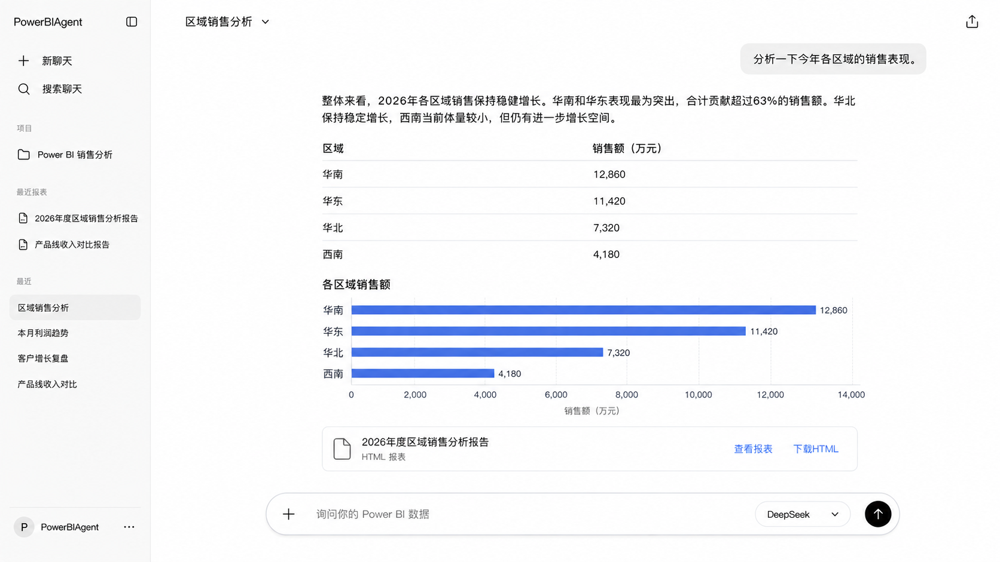
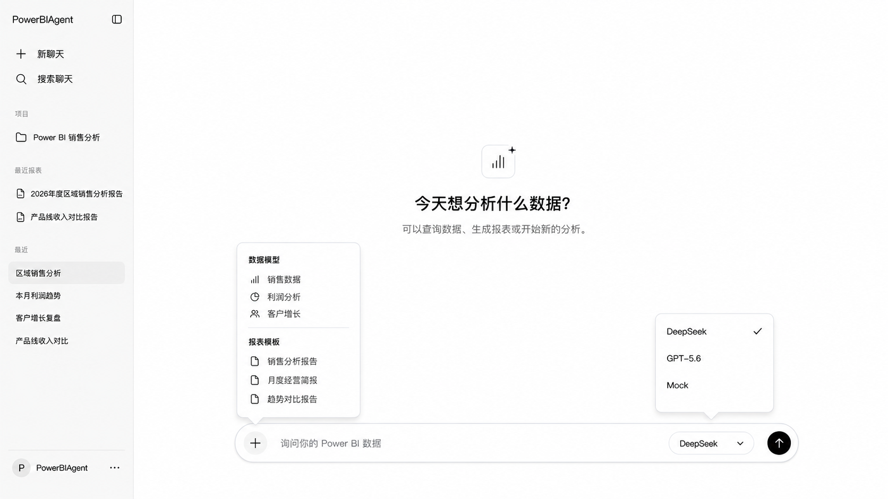

# 10 — 前端视觉与交互规范

> **状态：** M1.3.2 正式固化
> **目标阶段：** M5 React 前端开发时使用
> **视觉参考：**
> 
> 

---

## 一、文档目的

本文件记录 PowerBIAgent 前端的产品视觉方向与交互规范（参考）。内容基于两张前端参考图和项目负责人提供的文字化分析。

本文档是 M5 React 前端开发的产品方向参考。两张图片是前端视觉和产品方向参考，不是最终页面定稿。总体目标仍为简洁、清晰、参考 GPT 网页端。左侧栏内容、报表位置、导航层级和工作台结构尚未确定，将在 M5 重新完成整体信息架构、页面结构和交互设计。M2-M4 只固化通用数据、报表资源、会话和搜索契约，后端不得绑定 UI 布局规则。

## 二、当前阶段与实施边界

**当前阶段：** M1.3.2 — 只固化视觉规范，不开发前端。

- 不创建 React 项目
- 不创建 package.json、src、node_modules、CSS 或组件
- 完整前端开发在 M5 启动
- 最近报表、最近对话、搜索聊天等后端能力分别在 M3/M4 准备，前端 UI 统一在 M5 实现

## 三、视觉参考图片

| 图片 | 文件名 | 内容 |
|------|--------|------|
| 已有对话与组合回答态 | `assets/frontend/整体01.png` | 已有对话中的 AI 组合回答（文字+表格+图表+报表附件）、左侧栏、底部输入器 |
| 新聊天欢迎态与菜单展开态 | `assets/frontend/整体02.png` | 新聊天欢迎页、"+"菜单展开态、模型菜单展开态 |

## 四、视觉原则

1. **全局以纯白和极浅灰为主** — 主背景白色，分隔区域使用极浅灰
2. **正文使用黑色和深灰** — 高对比度，易阅读
3. **分隔线与边框使用浅灰** — 轻量不抢眼
4. **数据图表和可点击报表链接使用克制的蓝色** — 不作为大面积装饰色
5. **页面保持大面积留白** — 信息密度低，呼吸感强
6. **卡片圆角轻量** — 圆角小，不圆润
7. **阴影非常克制** — 仅在必要时使用微弱阴影
8. **不使用**：大面积渐变、深色背景、彩色仪表盘、大量装饰性 KPI 卡、复杂动画、多层嵌套面板

## 五、桌面端整体布局

桌面端采用左右两栏布局（参考布局，M5 确定最终方案）：

```
┌──────────────┬─────────────────────────────────────────┐
│   左侧栏      │              主对话区                     │
│  (参考比例)   │                                         │
│              │  ┌───────────────────────────────────┐  │
│  PowerBI     │  │  对话标题栏（已有对话态）            │  │
│  Agent       │  │  或欢迎态（新聊天）                 │  │
│              │  ├───────────────────────────────────┤  │
│  导航区      │  │                                   │  │
│  新聊天      │  │  消息流区域                        │  │
│  搜索聊天    │  │  · 用户消息                        │  │
│  项目        │  │  · AI 组合回答                     │  │
│  最近报表    │  │                                   │  │
│  最近对话    │  │                                   │  │
│              │  ├───────────────────────────────────┤  │
│  用户信息    │  │  底部输入器                        │  │
└──────────────┴──────────────────────────────────────┘  │
```

## 六、左侧栏

### 6.1 定位

- 新聊天和对话导航入口
- 展示项目入口
- 展示最近报表和最近会话
- **不展示：** Trace、日志、Memory 内部状态、系统健康状态、开发调试面板

### 6.2 内容（从上到下）

| # | 内容 | 说明 | 后端能力 | 前端 UI |
|---|------|------|---------|---------|
| 1 | PowerBIAgent 文字标识 | 品牌标识 | — | M5 |
| 2 | 侧栏折叠按钮 | 折叠/展开左侧栏 | — | M5 |
| 3 | 新聊天 | 创建新对话入口 | — | M5 |
| 4 | 搜索聊天 | 搜索历史对话 | M4 搜索与持久化 | M5 |
| 5 | "项目"分区标题 | 分区标签 | — | M5 |
| 6 | 当前 Power BI 分析项目 | 项目入口 | — | M5 |
| 7 | "最近报表"分区标题 | 分区标签 | — | M5 |
| 8 | 最近生成的报表列表 | 报表快捷入口 | M3 报表资源与 report_id | M5 |
| 9 | "最近"分区标题 | 对话分区标签 | — | M5 |
| 10 | 最近对话列表 | 当前选中使用浅灰背景 | M4 会话历史与持久化 | M5 |
| 11 | 用户信息 + 更多菜单 | 底部固定 | — | M5 |

## 七、新聊天欢迎态

### 7.1 布局

- 页面中央保持大量留白
- 垂直居中排列

### 7.2 内容

- 简单数据分析图标（中置）
- 主标题："今天想分析什么数据？"
- 副标题："可以查询数据、生成报表或开始新的分析。"

### 7.3 不展示

- 仪表盘
- 推荐 KPI 卡
- 系统模块列表
- 开发说明

## 八、已有对话态

### 8.1 顶部

- 左侧：当前对话标题（如"区域销售分析"）+ 轻量下拉箭头
- 右上角：分享或导出入口图标
- **不设计复杂导航栏**
- **不展示系统状态、模型 Token、Trace 等信息**

### 8.2 用户消息

- 位于主内容区右侧
- 使用浅灰圆角气泡
- 文本简洁
- **不使用**：高饱和背景、头像大卡片、复杂消息工具栏

### 8.3 AI 回答

- 位于主内容区中间偏左
- **默认不使用明显气泡背景**（与用户消息区分）
- 内容按自然阅读顺序纵向排列
- 回答最大内容宽度适中（不铺满超宽屏）

### 8.4 AI 组合回答顺序

同一条 AI 消息内的内容块按以下顺序排列：

1. 自然语言结论（文字）
2. 关键指标摘要（如存在）
3. 数据表格（如存在）
4. 基础图表（如存在）
5. 报表附件卡片（如存在）

## 九、表格

### 9.1 样式

- 直接嵌入 AI 回答，不独立弹出
- 白色背景
- 不使用厚重外框
- 使用浅灰横向分隔线
- 表头清晰（加粗或浅灰背景）
- 行距舒适（适当行高）
- 数字列右对齐或居中对齐

### 9.2 不设计

- 复杂筛选器
- 分页工作台
- 列排序交互（MVP）
- 列宽拖拽调整（MVP）

## 十、图表

### 10.1 样式

- 直接嵌入 AI 回答
- 标题简洁（如"各区域销售额"）
- 坐标轴清晰（含刻度标签）
- 数据标签可见（在柱/点旁标注数值）
- 颜色克制，优先单一蓝色

### 10.2 允许的图表类型

- bar（柱状图，含横向/纵向）
- line（折线图）
- pie（饼图）
- scatter（散点图）

### 10.3 禁止

- 3D 图表
- 花哨渐变
- 默认展示复杂交互工具栏（缩放、导出等）
- 图表数据来源虚构（必须来自 QueryResult）

## 十一、报表附件

### 11.1 样式

轻量横向卡片，与消息流齐宽。

### 11.2 内容

- 文件图标（左侧）
- 报表标题
- 文件类型（如"HTML 报表"）
- "查看报表"操作（链接/按钮）
- "下载 HTML"操作（链接/按钮）

### 11.3 规则

- 附件卡片属于 AI 消息的一部分
- 不设计独立复杂报表后台
- 查看和下载能力属于 M3 以后
- 当前不宣称已经支持正式报表下载

## 十二、底部输入器

### 12.1 样式

- 位于主内容区底部
- 宽大的圆角胶囊形容器
- 整体保持简洁和低干扰

### 12.2 组件（从左到右）

| 组件 | 说明 |
|------|------|
| "+"按钮 | 点击弹出"+"菜单 |
| 文本输入区域 | 占位文字："询问你的 Power BI 数据" |
| 模型选择菜单 | 下拉选择 LLM 模型 |
| 发送按钮 | 黑色圆形，提交问题 |

### 12.3 行为

- 开始对话后输入器固定或稳定停留在页面底部
- 支持 Enter 发送，Shift+Enter 换行
- 发送期间输入框禁用

## 十三、"+"菜单

点击输入器左侧"+"按钮后，在输入器上方弹出轻量菜单。

### 13.1 数据模型分组

展示可用 Power BI 语义模型列表。示例：

- 销售数据
- 利润分析
- 客户增长

实际内容来自后端允许的语义模型列表。正式联调属于 M2/M5。

### 13.2 报表模板分组

展示已登记报表模板列表。示例：

- 销售分析报告
- 月度经营简报
- 趋势对比报告

实际内容来自已登记模板白名单。正式联调属于 M3/M5。

### 13.3 规则

- 数据模型和报表模板不能混成一个无分类列表
- 当前选中项应有清晰视觉状态
- 未实现或无权限选项必须禁用或隐藏
- 前端不得自行生成不存在的模型和模板

## 十四、模型菜单

### 14.1 样式

输入器右侧的圆角下拉菜单。

### 14.2 选项（视觉可展示）

- DeepSeek
- GPT-5.6
- Mock

### 14.3 真实产品边界

> **当前 MVP 正式用户模型只有 DeepSeek。**
> Mock 仅用于开发和测试，不应作为正式用户模型展示。
> GPT-5.6 仅为图片中的未来视觉占位，不代表当前项目已经接入。
> 未来没有真实接入前，其他模型应隐藏或明确禁用。
> 模型菜单保留未来扩展入口，当前不形成多模型能力承诺。

## 十五、状态规范

### 15.1 加载状态

- 消息流中显示简洁等待反馈（如三点加载动画）
- 不创建独立 Loading 面板或全屏遮罩

### 15.2 空数据状态

- AI 消息说明"暂无符合条件的数据"或类似信息
- 不生成空图表和假指标
- 不显示空白表格

### 15.3 错误状态

- 作为普通对话反馈显示（非弹窗）
- 给出简洁错误描述
- 提供可重试提示（如适用）
- **不展示**：完整异常堆栈、Trace 详情、内部错误代码

### 15.4 禁用状态

以下情况必须明确禁用，不得制造可点击但无效果的按钮：

- 未接入的 LLM 模型（GPT-5.6 等）
- 未配置的数据模型
- 未登记的报表模板
- 未实现的查看报表功能
- 未实现的下载功能

## 十六、响应式原则

桌面端优先。窄屏或移动端（M5 实现）：

- 左侧栏折叠为抽屉（汉堡菜单触发）
- 主对话区占满可用宽度
- 输入器保持可操作（不溢出）
- 表格允许横向滚动
- 图表适配容器宽度
- 报表卡片操作不溢出

## 十七、当前 MVP 与未来能力

| 能力 | 当前状态 | 后端准备 | 前端实现 |
|------|---------|---------|---------|
| 左侧栏（完整） | 仅设计 | — | M5 |
| 新聊天欢迎态 | 仅设计 | — | M5 |
| AI 组合回答（表格+图表+附件） | 仅设计 | — | M5 |
| 最近报表列表 | 仅设计 | M3（报表资源、report_id、查看/下载） | M5 |
| 最近对话列表 | 仅设计 | M4（会话历史、持久化） | M5 |
| 搜索聊天 | 仅设计 | M4（搜索后端） | M5 |
| "查看报表"操作 | 仅设计 | M3（报表资源接口） | M5 |
| "下载 HTML"操作 | 仅设计 | M3（报表资源接口） | M5 |
| 多模型切换 | DeepSeek 唯一启用 | — | 未来 |
| 响应式布局 | 仅设计 | — | M5 |

> **M3/M4 只实现后端能力，不开发 React 前端 UI。所有前端界面统一在 M5 实现。**

## 十八、明确禁止的设计

### 禁止的页面形态

- 传统 BI 后台/数据治理平台
- 多面板企业工作台
- 管理驾驶舱
- Tab 式多页面后台

### 禁止的视觉风格

- 大面积渐变
- 深色背景
- 彩色仪表盘
- 大量装饰性 KPI 卡
- 复杂动画
- 多层嵌套面板

### 禁止的功能展示

- Trace / 日志 / Memory 内部状态（左侧栏）
- 系统健康状态（主对话区顶部）
- 模型 Token 用量（主对话区顶部）
- 开发调试面板

### 禁止的数据展示

- 把 Mock 数据描述为真实 Power BI 数据
- 把未接入模型（GPT-5.6 等）展示为可用
- 把 Mock 展示为用户正式模型
- 展示未经验证的数据结论

---

*创建日期：2026-08-03 | M1.3.2 前端视觉与结构化回答契约固化*
