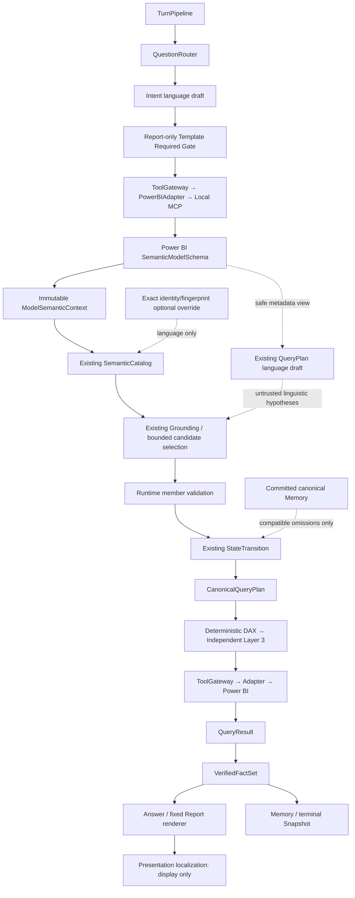

# M5.8.4 — 现有语义链跨语言与通用模型理解优化

状态：LOCAL/REAL FINAL PASS；待本次提交 exact-SHA CI completed/success。基线 `m5/rebuild` / `b86662ee00e52e318e09a4c02702cce8feeaab6f`，其 [PowerBIAgent Validation](https://github.com/Strange-Men/PowerBIAgent/actions/runs/33351533445) completed/success 已核验。M5.9/M5.10 NOT STARTED，M5 FINAL=false。

## A–E 后端复核

A. 唯一 authority/call graph：TurnPipeline → QuestionRouter → Intent weak draft → report-only Template Required Gate → ToolGateway → PowerBIAdapter/Local MCP → SemanticModelSchema → ModelSemanticContext → optional exact override → SemanticCatalog → Grounding/bounded selection → runtime members → StateTransition → CanonicalQueryPlan → deterministic DAX/Independent Layer3 → Power BI → QueryResult → VerifiedFactSet → Answer/Report → Memory/Snapshot。QueryPlan weak draft 在 schema 后；localization 只在 facts 后显示。

B. 已有能力：八 query shapes、metadata context/fingerprint、visible object ownership、relationships/hierarchies/部分 temporal evidence、strict overrides、runtime member validation、pending 与 committed 分离、KEEP/REPLACE、双 Provider snapshot 和 MCP session/cache/singleflight 均复用。

C. 重复/冲突：QueryPlan schema view 重建瘦身对象视图但不含已有语义 metadata；两套 prompt 重复解释对象且宣称 glossary-only；description exact 重复；bounded selector 前字面评分实际决定答案；模板字段在 Intent prompt/service fallback/后置 template grounding 中被重复当作意图；legacy glossary builder 只用于离线兼容，不是新生产链。

D. 根因：中文/英文无最长公共子串 → ZERO candidates；canonical weak dimension 不在中文原文 → NOT_MENTIONED；旧维度先继承 → 跨语言 REPLACE 可能漂移；筛选字段缺同样的 bounded language route；selector 丢失 context evidence；report_template_key 错误劫持 Data turn。时间分组缺证据不是允许猜测的理由。

E. 复用 Catalog/Context/Grounding，扩展角色候选与 evidence 投影、同一个 selector 和调用点；QueryPlan 保持 weak draft；删除重复匹配/冲突 prompt；service 中分离模板 choice 与 report intent。frozen DAX/facts/Memory/Provider/Report/MCP performance 不改。

复核覆盖用户列出的 intent/router/prompt/service、query_plan/context/deepseek_service/prompt/model_semantic_context/semantic_catalog/grounding/model_override/state_transition/clarification、application service/pipeline/discovery、powerbi/base/local_mcp、schemas、presentation localization、LLM registry/base、Memory/template gate，以及邻近 semantic/model-context/Real harness。约束见 [ADR-015](../../adr/ADR-015_cross_language_runtime_grounding.md)。

## 顺序计划与 acceptance matrix

1. Cold Start、完整 A–E 复核、专项 ADR/spec：在生产修改之前完成。
2. Failure reproducer → targeted regression → minimal implementation。
3. Fixture matrix：中文→英文、英文→中文/英文、同义词；SCALAR/ENTITY_LIST/GROUPED/RANKING Top1/TopN/MEMBER_SET/FILTERED_AGGREGATION/TREND/BOUNDED_TREND；KEEP/REPLACE、unknown member、ambiguous metric/dimension、schema mutation/stale context/override、A→B→A、Report→Data→Report、ZERO DAX。
4. Real：现有两 PBIX、无人工语言 override、DeepSeek/Kimi canonical consistency、QueryPlan/DAX/QueryResult/facts 观察；业务值只保存在 owned 临时证据或进程内，不提交 secrets/业务输出。不得修改用户 PBIX。
5. 性能：cold/warm/4-way，保留全部样本与 Provider 长尾；对照 M5.8.1/M5.8.3，不进行 M5.9 压测。
6. Semantic Compatibility、backend full pytest、Golden、frontend tests/typecheck/lint/build、Repository Safety、Architecture、AI Error Ledger、Documentation/Artifact Governance、compileall、diff check、Real Browser/人工观测、residual tempdir=0。
7. 文档/版本完成后 whitelist stage、中文 commit、push m5/rebuild；exact final SHA CI completed/success 后 COMPLETE。

### 验收矩阵与证据范围

| 要求 | 自动化证据 | Real 证据与限制 |
|---|---|---|
| 中文→英文、英文→中文、同义表达 | `test_zero_override_cross_language_shapes_at_chat_boundary`：4 种结构 × 8 shapes × 2 方向；unit 覆盖无字面 overlap 和同义词 | Rich 中文、英文、同义问题；真实 PBIX 均为英文，英文→中文由 fixture 验证 |
| SCALAR / ENTITY_LIST / GROUPED | 正式 Chat API 检查 canonical、DAX、facts、Memory | Rich 与 Simple 均有零 override 正向 witness |
| RANKING Top1 / TopN | API shape 矩阵及中英排序/Top1 unit | Rich 销量 Top1、金额 Top3；Simple Top1 |
| MEMBER_SET / FILTERED_AGGREGATION | API 双向矩阵；完整 literal、去重、部分草稿/缺失草稿拒绝 unit | 双 Provider 成员正反 14/14；最终完整批次独立核验 |
| TREND / BOUNDED_TREND | API 双向矩阵；确定性日历端点、完整 month-start member proof | Rich 月趋势/跨年有界趋势；Simple 无日期能力时澄清 |
| KEEP / REPLACE | canonical table identity 与当前显式双 owner 正反 unit；永久 multi-turn Gate | 正式 HTTP 时间/筛选 KEEP、维度/指标 REPLACE；浏览器两轮数据问答与 History 恢复 |
| unknown / ambiguous / ZERO DAX | API unknown/ambiguous metric/dimension、foreign ID、混合未知成员；QueryPlan 失败零执行 | Rich 未知、混合未知、模糊指标、复合区域、城市不扩大为区域；Provider 失败不能冒充语义拒绝 |
| schema mutation / stale context / override | 6 类 metadata mutation、exact binding/stale override、relationship mutation unit | 不修改用户 PBIX；mutation 使用 fixture，真实 session/identity 每次沿现有 Adapter 验证 |
| A→B→A 多 PBIX 隔离 | context/override identity 与 canonical owner 测试 | 13/13 isolation；10 个真实业务 witness、foreign member 拒绝且旧 Memory 不变 |
| Report→Data→Report | 6 个模板 choice/weak intent API 正反项、永久 Template Gate | HTTP extended 8/8；用户人工选择“简易模板”并完成浏览器报表生成 PASS |
| DeepSeek / Kimi 一致性 | 共享 CandidateSelection/非法 ID/错误角色 contract | 同 app/model 的 canonical 投影与 result hash 对比；最新完整 40/40、consistency 20/20 |
| 未注册模型 zero-config | Retail star、Education snowflake、Operations flat/multi-date、未知 holdout 共用既有 builder/catalog | Rich/Simple 都使用空 override；不宣称 fixture 等于四份真实 Desktop 或所有模型无条件可执行 |
| 性能与生命周期 | session/cache/singleflight 永久测试；21 个 owned temp/observer 回归 | 独立 cold/warm/4-way 12/12；每轮正式资源 cleanup 和 temp residual 检查，历史残留单独处理 |

上述 fixture 测试位于 `backend/tests/api/test_cross_language_grounding.py`、`backend/tests/unit/test_cross_language_grounding.py` 及相邻 `test_model_semantic_context.py`，均纳入 658 项 Semantic Compatibility 和 2312 项 backend 全量。fixture LLM 只证明控制面，不冒充真实语言质量；完整 Real 证据以文末最新批次为准。

本轮用户明确授权连续修复普通 P0/P1/测试失败，不采用旧“两次失败后停止”作为终止理由；不修改治理文件以规避规则，不扩大里程碑。不读取/打印/修改 .env，只由根目录启动的 Settings 自行加载。无 subagent、无 Tag、无 main/m5/frontend 修改。

用户本轮原文授权（M5.8.4，适用于 ERR-584-004）：
> 不要因为发现 P0/P1 或测试失败而中断，持续定位、修复、回归，直到满足 COMPLETE 条件；只有真正不可控的外部环境阻塞才允许最终报告 BLOCKED。

ERR-584-004 在具体地点被扩大为区域的失败首次确认后已有四次代码修改：同集合/粒度约束、逐 literal 隔离、模型内方向类别的常规本地化说明、移除末尾与 model-local category 冲突的 worldwide containment 判断。前三次未通过完整正反矩阵，第四次仍在 Real 收口；账本如实记录四次，不能保持一次或换 ID 重置。Ledger 校验器仅校验已有授权记录与条目/版本/专项文档原文一致；无授权的超过两次仍 FAIL。该记录不能自行授予未来 Agent 权限，实际用户消息始终是授权来源；CLAUDE 默认限制与其他权限不变。

## 失败证据与处理记录（不能冒充最终 PASS）

- 原 API reproducer：模板选择/weak report draft 劫持普通问题，6 例中 5 FAIL；修复后 6 PASS。
- 原跨语言对象入口：无中文字面 overlap 导致候选为空；跨语言维度弱草稿丢弃。删除 LCS 预排名，复用唯一 Catalog 的 role candidates 和 selector。
- Rich 无 override 首轮 7/11，随后 8/11、9/11，未达到 release 条件。销量口径、重复维表字段、输入值与字段的角色、成员常规翻译及月粒度分别定位；这些失败和 Provider 超时保留为诊断事实，不回填为通过。
- Selector 语言指令经过多轮诊断调整（同一成员问题的中英文提示、字段/当前问题上下文、成员排序、按角色职责拆分），未通过时持续保持澄清，不加入业务词典或失败自动重试到“选中”。正式运行仍是每个角色的一次 bounded selection。
- 导入的 YearMonth 无 calculated-column expression，不能猜测 format。现有日期列经 bounded language role + 完整 runtime month-start members 证明后可用；不创建列、不改 DAX。
- 成员集合 reproducer 证明原实现会丢掉已知＋未知中的未知 literal；最小修复保留每个当前原文并逐值校验，再合成 IN_SET。
- Simple PBIX 曾把“总销量”错误绑定金额、把不存在的订单指标错绑数量，品类也曾过度澄清。纳入正反 Real 对照，加入 runtime definition operand metadata，按计量口径/粒度分离 selector 职责；已有 QueryPlan 仅提供 runtime 名单内、显式 untrusted 的语言假设，不能裁剪候选或直接绑定。
- 旧字面分数 tie 的测试改为验证 selector 的 AMBIGUOUS/UNRESOLVED 保持；exact alias/qualified ownership 仍不调用 LLM，非法 ID/错误角色拒绝。缺失语言能力的离线 fake provider 显式 abstain，ZERO DAX/Memory 断言没有放宽。
- 后端全量初轮 2232 PASS/1 FAIL/1 SKIP，唯一失败是旧 prompt `eq-only` 文本断言；按 M5.8.2 已支持的 runtime-validated IN_SET 合同修复。后续一轮 2277 PASS/1 SKIP、Golden 11 PASS/1 manual skip；最终数字须以收口复跑为准。

完整 user → candidate evidence → canonical IDs/plan → DAX → QueryResult → facts witness 在自有 Real 进程内验证，输出只保留 canonical metadata、成员标签、计数/hash/时延，不提交业务行或 secrets。`--candidate-evidence` 可观察 bounded runtime metadata；fixture Provider 不冒充真实语言质量。

## 2026-08-31 下午复核证据（仍未达到 release 条件）

- 最新完整复跑：Semantic Compatibility 639 PASS（111 production files）；backend 2283 PASS / 1 manual skip；Golden 11 PASS / 1 manual skip；frontend 86 PASS，typecheck/lint/build PASS。Repository Safety 342 files、Architecture 128 Python files、Error Ledger 50 entries、Documentation/Artifact Governance、compileall、diff check 均通过。新增跨语言 unit/API 共 113 项，另有 17 项 acceptance temp lifecycle 回归；新增文件尚未暂存，提交前安全扫描会覆盖最终白名单。
- 同一份无 override Rich PBIX 的中文地区分组与“那销量呢”在浏览器完成，canonical 从 Total Sales 替换为 Total Quantity，Region 的 table owner 保持 Region；页面重载后通过正式 History 恢复两轮 table/chart。该证据为 Agent 实际操作/观察，不声称用户亲自操作。
- 浏览器模板选择因审批服务限制被拒绝；恢复时间过后仍要求新的明确批准，不绕过或用另一个工具间接点击。因此 Report→Data→Report 浏览器部分没有宣称 PASS。
- 双模型 Real 复跑出现长尾：scalar 95.57s / orders 102.95s / grouped 170.47s，entity selector 120.30s 后失败澄清。之前统一 unavailable 方法无法区分 response validation 和网络失败；现增加既有安全 error category 后缀，不输出 exception message/secrets，不把所有失败归咎外部环境。
- 新增成员负向对照暴露了城市被扩大为区域的 P0。合法 candidate ID 只能证明对象/成员存在，不能证明语言等价；现有成员 selector 必须判断同一集合/粒度的翻译或同义，禁止 containment/classification/关联推断。收紧后普通区域翻译、复合区域拒绝、未知地点拒绝三组双 Provider 对照 6/6 PASS，canonical/result 比较 3/3；该轮 business/temp residual=0。完整 40 项双 Provider 矩阵仍需最后收口，局部通过不替代全矩阵。
- 多 PBIX：Simple 四种正向 shape、无日期能力澄清、A→B→A 指标隔离、缺失指标 ZERO DAX、foreign member 拒绝且 Memory 不变，共 13/13 PASS，10 次真实业务 execution witness，business/temp residual=0。Report→Data→Report 与时间/筛选 KEEP、维度/指标 REPLACE、unknown follow-up 的正式 HTTP 验收 8/8 PASS，business/temp residual=0。
- 一轮本地 HTTP 观察超时后出现自有临时目录残留。原因是后台业务请求尚未退出就运行 teardown；验收脚本增加 request-scoped observer、退出前 drain/cancel、晚返回 report ownership 登记，并使 localhost HTTP 不走外部 proxy。生产 Provider timeout/retry、MCP 与 resource API 不变。17 项 acceptance temp lifecycle 回归通过（含完成/取消两条失败退出路径）。
- 上述失败目录 SQLite 的 conversation/memory/snapshot/report/delete-intent 表均已只读核验为 0，但原目录删除被执行策略拒绝，仍按 residual=1 记录；不得用另一路径绕过删除限制。其他正常完成的 owned run 均以实际 cleanup 输出为准。
- MCP component 复测（ms）：discovery cold/warm 8063/0，probe 4734/453，schema 1500/422，member 1406/422，DAX 875/1000，8 个同 key schema singleflight 484。新会话 startup 6953；session reuse=0.9091（包含首次启动），业务 turn reuse=1.0。M5.8.1 对照为 discovery 3782/0、schema 422/156、member 515/172、DAX 485/515；当前环境更慢，不能宣称性能提升。
- 完整 performance 12/12 PASS，12 个独立真实业务 DAX/QueryResult/facts witness，business/temp residual=0。bootstrap 20288.18ms，包含 bootstrap 的 cold journey 60828.57ms；first 四轮 40540.39 / 10316.48 / 203060.34 / 17806.97ms；warm 四轮 2753.76 / 24295.18 / 5723.72 / 2792.09ms（mean 8891.19ms）；4-way wall 14426.98ms，个别耗时 3047.13 / 3999.38 / 4745.94 / 14422.97ms。M5.8.3 的历史 warm 2433.50ms / 4-way 7193.27ms 仅作对照，问题、语言 override 与 Provider 抖动不同，不能宣称等价基准或长期 SLO。测试没有其他 Real phase 并发；启动阶段仍有本地 Mock Gate 进程。新增 selector 调用与 LLM 长尾会增加耗时；context/catalog 0–16ms、session reuse=1.0，未修改 worker/TTL/singleflight/concurrency，也未缓存任何 final Answer、CanonicalQueryPlan、DAX result、QueryResult 或 VerifiedFactSet。
- ZERO DAX 指正式业务执行链的 execute_dax/QueryResult；既有 runtime member lookup 可能在 Adapter 内使用只读 DAX 枚举，其 profiling 不能误报为业务查询。负向 Gate 同时要求无业务 QueryResult、无 Memory commit；不能用成员枚举数值回答业务问题。

## 后续失败路径复核（继续收口，不回填旧 PASS）

- 新增 object-scoped relationship_roles evidence：只标记该字段端点的 active/cardinality/related ID，保留完整候选，不把外键当作可自动替换的维表键。4 个端点/缺失/无效关系 reproducer 先 FAIL 后 PASS。
- weak filters 完全缺失或仅含已知部分时，成员 discovery 仍可把未知项丢掉。3 个中英 reproducer 先 FAIL；完整/部分 weak draft、三成员夹未知及含连词的合法成员名共同回归。现在并列短语覆盖不完整时拒绝，所有 literal 仍须 runtime validation，不能由覆盖检查生成对象/值。
- Real unproved_place 在 QueryPlan 120 秒超时后曾执行 filters=[] 的总额。这是应用层空草稿降级的 P0，不能仅归咎 Provider；两个 HTTP reproducer 均先 completed，修复后 validation_failed、ZERO DAX/Memory。移除 QueryPlanError→empty QueryPlan 路径；已有 Intent 恢复必须获得有效 QueryPlan draft 才能继续。旧测试的空草稿执行假设正式收紧，不恢复 fallback。
- Intent FilterSpec.value 只支持 scalar，但旧 prompt 同时提示 in/not_in，导致并列成员容易生成非法数组。prompt 改为逐 literal EQ 弱条件，组合仍由原 Grounding 决定，schema/Provider 不改。
- 两份 weak draft 对相同 literal 使用不同字段语言时，旧 StructuredFilter 去重把它们算成不同要求，同一个成员会重复 field/member selection。reproducer 证明两个成员执行四次 lookup；现在按 literal 的精确值和类型去重为两次，当前显式字段仍独立校验。这是请求内重复语言证据合并，不是缓存 selector、plan 或事实结果。
- canonical Memory owner 曾覆盖当前两个明确 Table[Column]。新增正反回归：省略 owner 的同字段合法 KEEP 保留；显式双 owner AMBIGUOUS 且 ZERO member lookup，不用旧 Memory 替用户决定。
- 直接在开发目录执行整份 Chat pytest 会继承开发数据库路径，该运行已停止。全量以无 dotenv 的 owned checkout 为正式证据；autouse fixture 现登记并隔离默认 SQLite 路径，与 report root 一起 finally 清理。开发库该时间窗新增两条会话，但缺少可证明归属的 ownership，保留不删除，不能声称用户库零残留。此风险已主动告知用户。
- 加入 SQLite fixture 后全量出现两处非生产问题：已销毁 service 的 id 被 Python 复用、默认路径测试读到 fixture 的环境覆盖。分别保留 service 对象并用 is not 比较、仅在不打开数据库的默认值测试内去除该变量。没有修改生产生命周期行为。
- 后续已通过的中间门禁：backend 2307 PASS / 1 SKIP，Golden 11/11 可运行项；Semantic Compatibility 655 PASS；frontend 86 PASS、typecheck/lint/build PASS。此前 pytest 隔离一轮 2305 PASS / 2 FAIL / 1 SKIP 的失败已修正；之后新增双 owner 回归与成员语言调整，最终完整复跑仍需完成，不能用中间数字宣布 COMPLETE。
- Real 新增负向验收观察所有 Provider task 的安全类别/错误码/声明字段错误类型，不输出 raw response/secret；弱草稿层处理过的异常也不能被澄清包装成语义 PASS。Windows stdout/stderr 显式 UTF-8，避免中文证据在重定向时损坏。

## 18 时后的最新证据（发布条件仍未齐备）

- 最新生产源码全量：backend 2312 PASS / 1 SKIP，Golden 11 PASS / 1 manual skip；Semantic Compatibility 658 PASS / 111 production files。跨语言 unit/API 132 PASS；验收生命周期/失败归因 21 PASS；Ledger 53 entries、Architecture 128 Python files、Documentation/Artifact Governance 通过。前端 86 PASS，typecheck/lint/build PASS。安全扫描 342 PASS（337 个已跟踪文件加 5 个未忽略新文件），另单独复查 5 个待提交新文件无 findings。最新全量 owned checkout cleanup 输出 temporary_residual=0。
- 最新成员正反矩阵 14/14 PASS：华南、华南/华北分别、合计、未知、已知＋未知、复合区域、不能证明归属的具体地点，DeepSeek/Kimi 各一轮；7 组 canonical/result consistency 全部通过，6 个真实业务 DAX/result/facts witness，business/temp residual=0。一次 Intent 格式修复事件保留在原始记录，不伪装为从未失败。
- 完整 40 项批次结果为 35/40，不能写为该批次全绿：DeepSeek quantity 的 QueryPlan read timeout、mixed_unknown 的 Intent schema error，Kimi ambiguous 的 selector read timeout、compound_region 的连接失败；quantity 的 Provider consistency 也因此把另一个 profile 标成失败。其余正向 canonical/result 一致。quantity 已在独立 fresh 双 Provider 中 2/2 PASS（完整 candidate/DAX/QueryResult/VerifiedFactSet console witness），mixed_unknown/compound_region 已由最新 14 项矩阵覆盖；Kimi ambiguous 仍需最终复测，完整矩阵仍需收口。
- Real observer 区分 Intent/QueryPlan 正式格式修复后成功与未恢复的异常；保留全部失败记录并标注 repaired，不能把其他 semantic-selection 调用的成功用来掩盖前一 selector 失败。负向 PASS 必须有实际语义拒绝证据且无未恢复 Provider 失败。
- 该轮当时 Git push dry-run 成功；HEAD/origin m5/rebuild 仍均为 M5.8.3 基线 b86662e，没有提前 commit/push；浏览器与 residual 外部审批问题在当时尚未解决。2026-09-01 已按本文末尾最终证据完成收口，正式 COMPLETE 仍以本次提交的 exact-SHA CI success 为条件。
- 最终独立 performance 复测 12/12 PASS，12 个真实 DAX/result/facts witness，Provider failures=[]，business/temp residual=0。bootstrap 13320.79ms，cold journey 24601.61ms；first 四轮 11280.82 / 29708.21 / 125138.02 / 119971.49ms；warm 四轮 2593.33 / 6578.11 / 19914.35 / 3075.37ms（mean 8040.29ms）；4-way wall 30920.78ms，个别耗时 3834.62 / 5642.85 / 28486.15 / 30917.88ms。该轮没有其他 Real phase 或 full gates 并发，session reuse=1.0，context/catalog 0–16ms。first entity 的 Intent 118016ms、first grouped 的 Grounding 104219ms 解释主要长尾，不宣称相对历史基准的性能提升。独立核对全部 12 个 canonical measure/dimension，并修正 harness 对 first_ label 的断言归一化；生产代码没有变化。

## 21 时后的完整 Real 收口证据

- 同一应用/同一 Rich PBIX、空 override 的完整 fresh 双 Provider 批次：40/40 PASS，DeepSeek/Kimi 各 15 个正向和 5 个负向；canonical/result consistency 20/20，30 个真实 DAX/QueryResult/VerifiedFactSet witness，business_residual=0、temporary_residual=0。旧 35/40 批次仍保留为失败记录，不回填。
- 五个负向均为实际语义拒绝：未知成员、已知＋未知、未指定指标的模糊排名、复合区域不折叠、具体城市不扩大为区域，全部 ZERO business DAX/QueryResult/Memory commit；没有未恢复 Provider 异常冒充语义拒绝。Kimi mixed_unknown 本轮耗时 124483.75ms，长尾不能隐藏。
- 两个 Provider 的 bounded trend 各记录两次 Intent time_intent schema error；既有 Router 恢复路径随后获得有效 QueryPlan 草稿，确定性日期范围、月份字段、DAX/facts 全部正确。这是已观察到的格式可靠性/延迟限制，不声称本批次所有内部调用无错误。
- 后置独立核验 6 个 member_set/combined/category 计划的完整成员集合、聚合维度和 table owner 均 PASS；相应条件已补入可复用 harness。另补强 extended 的完整时间/筛选/指标 KEEP/REPLACE、unknown 后 Memory 不变、Report 产物存在和缺模板 ZERO tools/witness，以及 isolation 的实际 runtime member 值断言。原记录经人工读取正确，但原脚本部分只自动检查 shape/terminal，不能继续依赖较弱断言。补强后生命周期 21 PASS、compileall/diff check PASS，正在复跑 extended/isolation 与隔离 full gates。
- 补强 extended 第一轮为 6/8：新增报告断言误把 source_mode 当作 ReportResponse 字段，实际正式 contract 在 execution_audit。按 `api/schemas.py`、`api/routes.py` 与 service 的当前代码修正读取位置，并核验 HTML 的 SHA-256，不改生产 Report 边界。fresh extended 随后 8/8 PASS、Provider failures=[]、16 个业务 witness、business/temp residual=0；完整时间/筛选/维度/指标与 Memory 不变断言均通过。
- 补强后的 fresh isolation 13/13 PASS，Kimi 使用现有 Rich/Simple 两 PBIX；10 个真实业务 witness，Provider failures=[]，business/temp residual=0。Simple 四种查询 shape、缺少日期能力、A→B→A 指标切换、B 缺失 A 指标、两模型各自实际成员和 foreign member ZERO DAX/Memory 不变均通过。
- 最终源码隔离 backend 2312 PASS / 1 SKIP（191.02s），Golden 11 PASS / 1 manual skip，owned checkout temporary_residual=0。Repository Safety 342 files、Artifact Governance、compileall/diff check 再次通过。至此自动化与正式 HTTP Real 项均收口。
- 2026-09-01 用户人工选择“简易模板”并完成浏览器报表生成验收；原自有目录 `powerbiagent-context-real-rq36p1xa` 由用户删除并只读复核 `Test-Path=False`，四类 M5.8.4 受控 temp prefix 均为 0。用户明确要求保留两条 ownership 不明会话，不将无法证明属于 M5.8.4 的会话作为 residual blocker；未删除或修改它们。最终 residual 定义固定为 M5.8.4 明确自建 validation/temp/browser 资源，当前 residual=0。本地/Real FINAL PASS，待白名单 commit/push 与 exact-SHA CI；此时仍不提前声明正式 COMPLETE。
